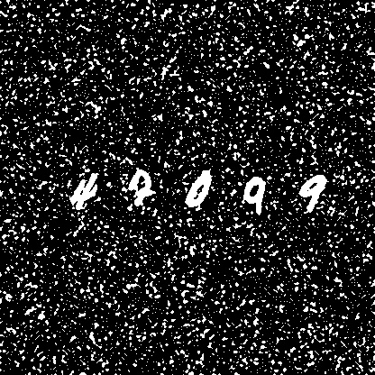
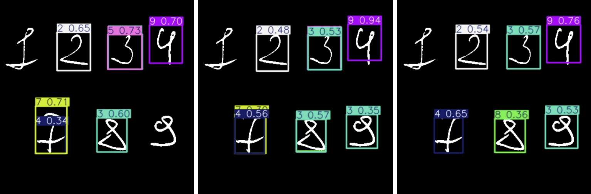

# Handwritten Digit Detection

## Problem Statement

This project focuses on the task of detecting multiple handwritten digits within a single image. Unlike traditional classification tasks, where the goal is to assign a single label to an entire image (e.g., identifying a single digit in an MNIST image), this problem involves localizing and identifying multiple digits in a complex scene. The challenge lies in accurately detecting the position and identity of each digit, which requires object detection techniques rather than simple classification.

The goal of this repository is to develop a solution for detecting multiple handwritten digits in images, leveraging object detection frameworks to achieve this.

## Approach

To tackle this problem, I have chosen to start with the YOLO (You Only Look Once) object detection model due to its speed and ease of use. YOLO provides a robust starting point for detecting multiple objects (in this case, digits) in an image efficiently. If successful, the generated dataset and initial results can be used to experiment with other models, such as Faster R-CNN or SSD, to compare performance.

### Dataset Generation

To train the model, I created a script that generates a custom dataset by combining handwritten digit images from the MNIST dataset. The dataset consists of 500,000 images, each containing multiple digits placed in varied positions to simulate real-world scenarios where digits appear in different locations and orientations.

#### Dataset Updates

The dataset has been enhanced to increase robustness and simulate more challenging conditions:
- **Background Noise**: Added random lines behind the digits and various shapes (circles, squares, rectangles) to mimic cluttered backgrounds.
- **Salt and Pepper Noise**: Introduced Salt and Pepper noise, a type of impulse noise where random pixels in the image are set to either black or white, resembling specks of salt and pepper. This noise simulates scenarios where image binarization (e.g., converting to black-and-white) may fail due to pixel-level distortions, making detection more challenging.

Below is an example of an image with Salt and Pepper noise applied:

##### Data Augmentation

To improve model generalization, I applied specific data augmentations during dataset generation:
- **Scale**: Adjusted the size of digits to simulate variations in digit size.
- **Translate**: Shifted digits to different positions within the image to account for positional variability.

Other augmentations (e.g., rotation, shear) were disabled, as they were found to negatively impact digit recognition performance.

#### Example Image

Below is an example of a generated image from the dataset, showing multiple handwritten digits with added background noise:

### Results

Results are not satisfying, the model trained on 500,000 images badly detect hand-written numbers from my test set:

## Next Steps

- Decrease YOLO dataset t 200,000 images with added noise and selected augmentations.
- Evaluate the model's performance in detecting and classifying multiple digits under noisy conditions.
