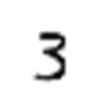
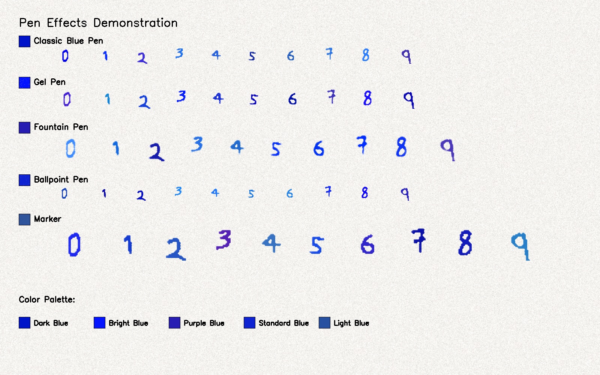

# Handwritten Digit Detection Project

## Problem Statement

This project aims to detect multiple handwritten digits in a single image using object detection techniques. Unlike classification tasks that assign a single label to an image, this task involves localizing and identifying multiple digits within complex scenes. The challenge is to accurately detect the position and identity of each digit.

## Issues Encountered

During the development and training process, several issues were identified:
- The model consistently fails to recognize the digit "1".
- Frequent confusion between digits: "4" is mistaken for "9", "9" for "3", and "7" for "4".
- Models trained on synthetic data (e.g., MNIST-based) perform worse than those trained on the Connected Digits dataset.
- Data augmentations critically impact performance, with some augmentations degrading training outcomes.
- Training instability: the model "forgets" certain digits on later epochs, leading to inconsistent performance.

## Actions Taken

### Datasets Used

Initially, the MNIST dataset was used to generate synthetic images for training. However, MNIST has significant limitations, as outlined in this article: [Why MNIST is the Worst Thing That Has Ever Happened to Humanity](https://matteo-a-barbieri.medium.com/why-mnist-is-the-worst-thing-that-has-ever-happened-to-humanity-49fd053f0f66). Below is an example of an MNIST-based image, highlighting its simplistic and unrealistic nature:

To create a robust dataset for training, the following datasets were utilized:
- **[Handwritten Digits Dataset (Not in MNIST)](https://www.kaggle.com/datasets/jcprogjava/handwritten-digits-dataset-not-in-mnist)**: A dataset of handwritten digits, available for download at [GitHub - Handwritten-Digit-Dataset v1.2.0](https://github.com/JC-ProgJava/Handwritten-Digit-Dataset/releases/tag/v1.2.0) in the `dataset.zip` file.

- **[Touching Digits Dataset](https://web.inf.ufpr.br/vri/databases/touching-digits/)**: A dataset containing handwritten digits that may overlap or touch, simulating complex detection scenarios.

- **[English Handwritten Characters Dataset](https://www.kaggle.com/datasets/dhruvildave/english-handwritten-characters-dataset?select=english.csv)**: A dataset of handwritten digits and letters, used to introduce realistic background noise and character variations.

### Dataset Generation

A dataset of 16,000 images was created by combining the above datasets. A script was developed to overlay digits and letters from these datasets onto images, simulating complex scenes with multiple characters. To improve robustness, a separate handwritten characters dataset was used to introduce background noise, as I noticed that without this, the model was overly sensitive to non-digit elements (e.g., random shapes or patterns). Letters were not labeled as a separate class.

The example of dataset frame:

#### Initial Binary Dataset

The first version of the dataset was binary, where images were converted to black-and-white to simplify processing. However, I decided to move away from this format because binarization results in significant information loss. For example, subtle variations in stroke thickness, shading, and texture of handwritten digits are discarded, which reduces the model’s ability to generalize to real-world scenarios where digits may appear on varied backgrounds or with different writing styles. This loss of detail also made it harder for the model to distinguish between similar digits (e.g., "4" and "9") and contributed to poor performance in noisy environments.

#### Transition to Color Dataset

To address the limitations of the binary dataset, I transitioned to a color dataset. The background is generated to resemble the texture and appearance of a paper sheet, incorporating realistic elements like faint lines, creases, or slight color variations. The digits and letters are rendered in various colors and styles to mimic real-world writing instruments (e.g., pens or markers with different stroke widths and forms). This approach offers several advantages:
- **Improved Realism**: The paper-like background better simulates real-world conditions, making the model more robust to variations in lighting, texture, and noise.
- **Enhanced Character Representation**: Colored digits and letters preserve more visual information, such as stroke intensity and slight variations in hue, which help the model distinguish between similar characters.
- **Better Generalization**: Training on color images with realistic backgrounds reduces overfitting to simplistic or artificial patterns, improving performance on diverse test sets.

Below is an example of an image from the color dataset, showcasing the paper-like background and digits/letters rendered to imitate pen writing:

### Model Development

Two models were prepared to address the digit detection task: one for object detection and another for segmentation.

#### Detection Model

The detection model, trained on the combined dataset of 20,000 images, shows reduced sensitivity to background noise compared to previous iterations. However, new issues have emerged:
- The model struggles to distinguish between digits, often failing to recognize them correctly.
- In some cases, the model fails to detect digits entirely.

Below is an example illustrating these issues:

#### Segmentation Model

A segmentation model was also trained to explore an alternative approach. This model demonstrates improved robustness to background noise but faces significant challenges:
- The model frequently fails to detect digits.
- Training is unstable, with performance fluctuating between epochs. For example, comparing results at 17 and 33 epochs shows inconsistent scores, indicating that the model struggles to converge.

Below is an example of the segmentation model's output:

### Updated Results with Color Dataset

The transition to the color dataset with pen-imitated digits and letters has shown limited improvement. While the detection model benefits slightly from the realistic backgrounds and varied character styles, the overall performance remains unsatisfactory. The model continues to struggle with digit recognition, particularly failing to detect the digit "1" and confusing "4" with "9". The segmentation model shows improved noise resistance but often mistakes quotation marks or letters for digits, assigning them classes like "1" or "4". This may be due to thin segmentation masks, suggesting that more robust dataset annotation is needed. Unfortunately, the results for both models are still not promising, indicating that further refinements are required.

## Next Steps

- Refine the color dataset annotation process to create more precise and robust segmentation masks, addressing issues with thin mask edges.
- Experiment with targeted augmentations (e.g., color jitter, subtle rotations) to enhance model generalization without degrading performance.
- Address training instability in the segmentation model, potentially by adjusting learning rates, adding regularization, or using techniques like learning rate scheduling.