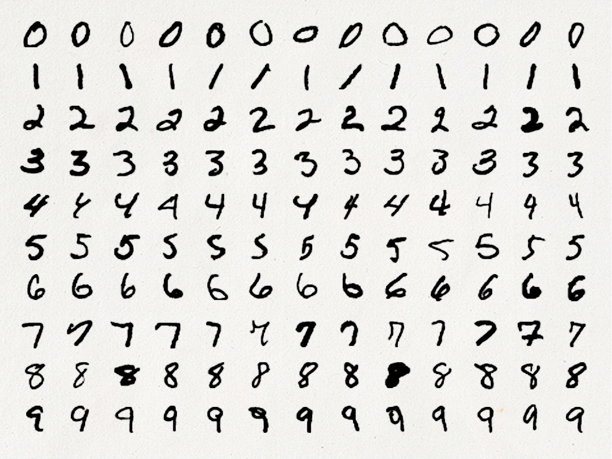
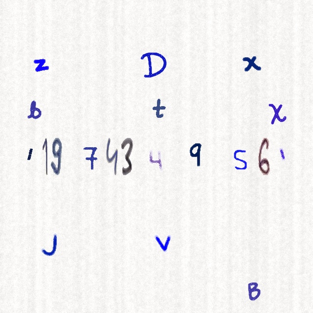
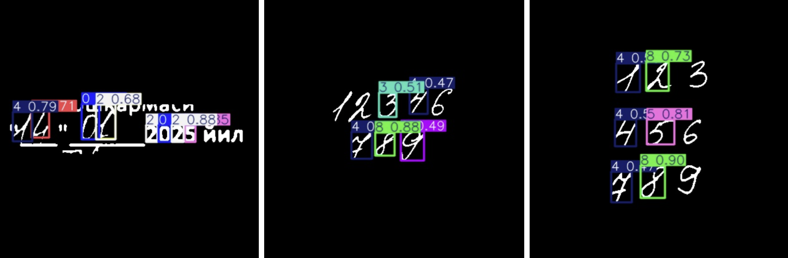
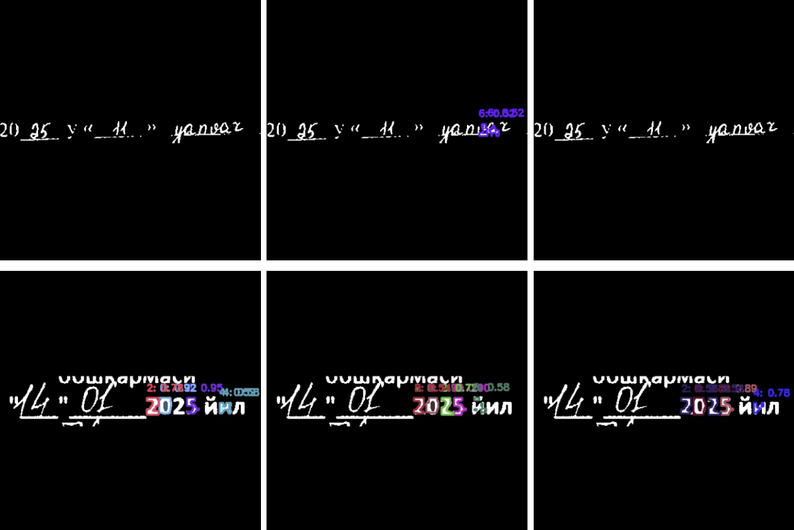

# Handwritten Digit Detection Project

## Problem Statement

This project aims to detect multiple handwritten digits in a single image using object detection techniques. Unlike classification tasks that assign a single label to an image, this task involves localizing and identifying multiple digits within complex scenes. The challenge is to accurately detect the position and identity of each digit.

## Issues Encountered

During the development and training process, several issues were identified:
- The model consistently fails to recognize the digit "1".
- Frequent confusion between digits: "4" is mistaken for "9", "9" for "3", and "7" for "4".
- Models trained on synthetic data (e.g., MNIST-based) perform worse than those trained on the Connected Digits dataset.
- Data augmentations critically impact performance, with some augmentations degrading training outcomes.
- Training instability: the model "forgets" certain digits on later epochs, leading to inconsistent performance.

## Actions Taken

### Dataset Transition

Initially, the MNIST dataset was used to generate synthetic images for training. However, MNIST has significant limitations, as outlined in this article: [Why MNIST is the Worst Thing That Has Ever Happened to Humanity](https://matteo-a-barbieri.medium.com/why-mnist-is-the-worst-thing-that-has-ever-happened-to-humanity-49fd053f0f66). Below is an example of an MNIST-based image, highlighting its simplistic and unrealistic nature:



Due to these limitations, MNIST was replaced with a more robust dataset: [Handwritten Digits Dataset (Not in MNIST)](https://www.kaggle.com/datasets/jcprogjava/handwritten-digits-dataset-not-in-mnist), available for download at [GitHub - Handwritten-Digit-Dataset v1.2.0](https://github.com/JC-ProgJava/Handwritten-Digit-Dataset/releases/tag/v1.2.0) in the `dataset.zip` file.

### Dataset Generation

Here is a view on one frame from new dataset:



A new dataset of 20,000 images was created by combining the [Handwritten Digits Dataset (Not in MNIST)](https://www.kaggle.com/datasets/jcprogjava/handwritten-digits-dataset-not-in-mnist) with the [Touching Digits Dataset](https://web.inf.ufpr.br/vri/databases/touching-digits/). A script was developed to overlay digits from both datasets onto images, simulating complex scenes with multiple digits. Additionally, a separate handwritten digits dataset was used to introduce background noise, as I noticed that without this, the model was overly sensitive to non-digit elements (e.g., random shapes or patterns). Letters were not labeled as a separate class.

Below is an example from the Touching Digits dataset:


To download and use the Handwritten Digits Dataset (Not in MNIST), you can follow these steps:

```bash
# Download the dataset from GitHub
wget https://github.com/JC-ProgJava/Handwritten-Digit-Dataset/releases/download/v1.2.0/dataset.zip

# Unzip the dataset
unzip dataset.zip -d handwritten_digits_dataset
```

### Model Development

Two models were prepared to address the digit detection task: one for object detection and another for segmentation.

#### Detection Model

The detection model, trained on the combined dataset of 20,000 images, shows reduced sensitivity to background noise compared to previous iterations. However, new issues have emerged:
- The model struggles to distinguish between digits, often failing to recognize them correctly.
- In some cases, the model fails to detect digits entirely.

Below are examples illustrating these issues:




#### Segmentation Model

A segmentation model was also trained to explore an alternative approach. This model demonstrates improved robustness to background noise but faces significant challenges:
- The model frequently fails to detect digits.
- Training is unstable, with performance fluctuating between epochs. For example, comparing results at 17 and 33 epochs shows inconsistent scores, indicating that the model struggles to converge.

Below is an example of the segmentation model's output:



## Next Steps

- Address false positives and digit recognition issues in the detection model by refining the dataset or adjusting classification thresholds.
- Investigate the segmentation model’s instability, potentially by experimenting with different learning rates or regularization techniques.
- Experiment with different augmentation strategies to identify which ones improve performance without degrading results.
- Test alternative object detection and segmentation models (e.g., Faster R-CNN, SSD, or U-Net) to compare performance with the current YOLO-based approach.