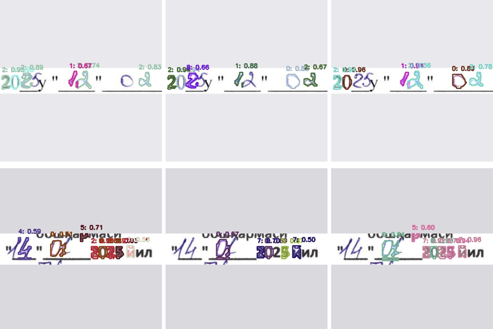

# Handwritten Digit Detection Project

## Problem Statement

This project aims to detect multiple handwritten digits in a single image using object detection techniques. Unlike classification tasks that assign a single label to an image, this task involves localizing and identifying multiple digits within complex scenes. The challenge is to accurately detect the position and identity of each digit.

## Issues Encountered

During the development and training process, several issues were identified:
- The model consistently fails to recognize the digit "1".
- Frequent confusion between digits: "4" is mistaken for "9", "9" for "3", and "7" for "4".
- Models trained on synthetic data (e.g., MNIST-based) perform worse than those trained on the Connected Digits dataset.
- Data augmentations critically impact performance, with some augmentations degrading training outcomes.
- Training instability: the model "forgets" certain digits on later epochs, leading to inconsistent performance.

## Actions Taken

### Dataset Transition

Initially, the MNIST dataset was used to generate synthetic images for training. However, MNIST has significant limitations, as outlined in this article: [Why MNIST is the Worst Thing That Has Ever Happened to Humanity](https://matteo-a-barbieri.medium.com/why-mnist-is-the-worst-thing-that-has-ever-happened-to-humanity-49fd053f0f66). Below is an example of an MNIST-based image, highlighting its simplistic and unrealistic nature:


Due to these limitations, MNIST was replaced with a more robust dataset: [Handwritten Digits Dataset (Not in MNIST)](https://www.kaggle.com/datasets/jcprogjava/handwritten-digits-dataset-not-in-mnist), available for download at [GitHub - Handwritten-Digit-Dataset v1.2.0](https://github.com/JC-ProgJava/Handwritten-Digit-Dataset/releases/tag/v1.2.0) in the `dataset.zip` file.

### Dataset Generation

A dataset of 20,000 images was created by combining the [Handwritten Digits Dataset (Not in MNIST)](https://www.kaggle.com/datasets/jcprogjava/handwritten-digits-dataset-not-in-mnist) with the [Touching Digits Dataset](https://web.inf.ufpr.br/vri/databases/touching-digits/). A script was developed to overlay digits from both datasets onto images, simulating complex scenes with multiple digits. Additionally, a separate handwritten digits dataset was used to introduce background noise, as I noticed that without this, the model was overly sensitive to non-digit elements (e.g., random shapes or patterns). Letters were not labeled as a separate class.

Below is an example from the Touching Digits dataset:


To download and use the Handwritten Digits Dataset (Not in MNIST), you can follow these steps:

```bash
# Download the dataset from GitHub
wget https://github.com/JC-ProgJava/Handwritten-Digit-Dataset/releases/download/v1.2.0/dataset.zip

# Unzip the dataset
unzip dataset.zip -d handwritten_digits_dataset
```

#### Initial Binary Dataset

The first version of the dataset was binary, where images were converted to black-and-white to simplify processing. However, I decided to move away from this format because binarization results in significant information loss. For example, subtle variations in stroke thickness, shading, and texture of handwritten digits are discarded, which reduces the model’s ability to generalize to real-world scenarios where digits may appear on varied backgrounds or with different writing styles. This loss of detail also made it harder for the model to distinguish between similar digits (e.g., "4" and "9") and contributed to poor performance in noisy environments.

#### Transition to Color Dataset

To address the limitations of the binary dataset, I transitioned to a color dataset. In this updated dataset, the background is generated to resemble the texture and appearance of a paper sheet, incorporating realistic elements like faint lines, creases, or slight color variations. The digits themselves are rendered in various colors to mimic real-world writing instruments (e.g., pens or markers). This approach offers several advantages:
- **Improved Realism**: The paper-like background better simulates real-world conditions, making the model more robust to variations in lighting, texture, and noise.
- **Enhanced Digit Representation**: Colored digits preserve more visual information, such as stroke intensity and slight variations in hue, which help the model distinguish between similar digits.
- **Better Generalization**: By training on color images with realistic backgrounds, the model is less likely to overfit to simplistic or artificial patterns, improving its performance on diverse test sets.

Below is an example of an image from the color dataset, showcasing the paper-like background and colored digits:


### Model Development

Two models were prepared to address the digit detection task: one for object detection and another for segmentation.

#### Detection Model

The detection model, trained on the combined dataset of 20,000 images, shows reduced sensitivity to background noise compared to previous iterations. However, new issues have emerged:
- The model struggles to distinguish between digits, often failing to recognize them correctly.
- In some cases, the model fails to detect digits entirely.

Below are examples illustrating these issues:


#### Segmentation Model

A segmentation model was also trained to explore an alternative approach. This model demonstrates improved robustness to background noise but faces significant challenges:
- The model frequently fails to detect digits.
- Training is unstable, with performance fluctuating between epochs. For example, comparing results at 17 and 33 epochs shows inconsistent scores, indicating that the model struggles to converge.

Below is an example of the segmentation model's output:



### Updated Results with Color Dataset
The transition to the color dataset has yielded mixed results. In some cases, the detection model, trained on the new color dataset with realistic paper-like backgrounds and colored digits, performs better, showing improved robustness to non-digit elements. However, the overall performance remains underwhelming, with persistent challenges in digit recognition, particularly in distinguishing similar digits (e.g., the digit "1" is still frequently undetected, and confusions between "4" and "9" persist). The segmentation model exhibits similar issues, with enhanced resistance to background noise but poor digit detection and unstable training. Notably, the segmentation model often mistakes quotation marks for digits, assigning them classes such as "1" or "4". This suggests that the current dataset labeling, particularly the thin edges of segmentation masks, may be contributing to these errors. Improving accuracy likely requires revising the dataset annotation process to create more robust and precise masks.

## Next Steps

- Refine the color dataset to further reduce false positives and improve digit recognition accuracy.
- Experiment with targeted augmentations (e.g., color jitter, subtle rotations) to enhance model generalization without degrading performance.
- Address training instability in the segmentation model, potentially by adjusting learning rates, adding regularization, or using techniques like learning rate scheduling.
- Test alternative object detection and segmentation models (e.g., Faster R-CNN, SSD, or U-Net) to compare performance with the current YOLO-based approach.